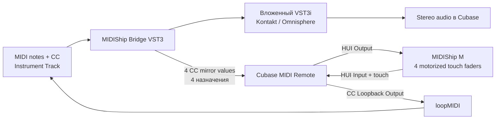

# MIDIShip Bridge

MIDIShip Bridge 0.5.0 —
VST3-инструмент-обёртка для Cubase, который загружает
другой VST3-инструмент внутрь себя и связывает его MIDI CC с четырьмя
моторизированными touch-фейдерами MIDIShip M в режиме HUI.

Плагин рассчитан на `Instrument Track`. Ноты, pitch bend и остальные MIDI-данные
проходят во вложенный Kontakt, Omnisphere или другой VST3i, а четыре выбранных
CC одновременно публикуются как параметры Bridge. Cubase MIDI Remote преобразует
их в HUI для моторов. В обратную сторону движение фейдера через отдельный
loopMIDI-порт снова становится обычным MIDI CC, который Cubase записывает в
MIDI-part. MIDI Send на Instrument Track для этого не требуется.

Перед первым тестом сохраните копию проекта Cubase.

## Текущая версия

- Имя `MIDIShip Bridge`, vendor `Andrey Zubets`, manufacturer code `AnZu`,
  plug-in code `MSB1`, bundle id `ru.andreyzubets.midishipbridge`.
- Компактный интерфейс с четырьмя реальными полосами MIDIShip M и заводским
  набором `CC1 / CC2 / CC11 / CC21`.
- Браузер установленных VST3 со строкой поиска, обновлением списка и ручным
  выбором файла или bundle.
- До 12 избранных инструментов, управление порядком списка и общий
  импорт/экспорт Favorites и пользовательских CC-пресетов.
- Выбранный в браузере или избранном инструмент загружается сразу.
- Опция `Auto-open instrument` по умолчанию открывает нативный редактор
  дочернего VST3 параллельно с компактным окном Bridge. Окно Bridge остаётся
  доступным для смены инструмента, избранного и CC; закрытый редактор можно
  вернуть кнопкой `Open instrument`.
- Для Kontakt 8.11 добавлен общий для процесса кэш описаний VST3. Первый Bridge
  выполняет медленное сканирование flat-модуля один раз, а последующие экземпляры
  с тем же путём создаются по сохранённому `PluginDescription` без повторного
  `findAllTypesForFile` при уже работающем Kontakt.
- Проект установщика Inno Setup 6 резервирует обновляемый MIDIShip Bridge и его
  актуальный профиль MIDI Remote. Устаревшие пользовательские MIDI Remote-
  профили установщик не удаляет.

Поскольку VST3 ID изменился в ветке 0.2, Cubase считает MIDIShip Bridge новым инструментом. Экземпляры
старого `HUI CC Bridge` в существующих проектах не заменяются автоматически.
Перед миграцией сохраните старый проект и перенесите дорожки осознанно.

## Схема работы

Bridge работает в процессе Cubase: хост видит его как инструмент, а Bridge
создаёт экземпляр дочернего VST3i. Это не отдельный процесс и не crash isolation.

Физический HUI-тракт и виртуальный CC loopback должны оставаться раздельными.
Для MIDIShip M Windows показывает одно и то же имя `TinyUSB Device` в списках
входов и выходов. Это нормально: выберите его и для `HUI Input`, и для
`HUI Output`; направление задаётся самим логическим портом. `CC Loopback Output`
назначается только на отдельный loopMIDI-порт.

Физический `TinyUSB Device` необходимо исключить из `All MIDI Inputs`. В режиме
HUI устройство передаёт служебные Control Change и heartbeat; без исключения они
могут попасть непосредственно на Instrument Track и смешаться с CC loopback.

## Как выбирается активный экземпляр

HUI обслуживает только один Bridge. Передача активна, когда профиль MIDI Remote
загружен и одновременно:

1. выбрана Instrument Track с `MIDIShip Bridge`;
2. на выбранной дорожке включён `Record Enable`.

При десяти экземплярах моторы следуют выбранной и вооружённой дорожке. Другие
Bridge продолжают воспроизводить свои инструменты, но не отправляют значения на
физическую поверхность. Желательно оставлять вооружённой только выбранную
дорожку, слушающую общий loopMIDI-порт.

## Быстрый старт

Полная актуальная настройка находится в
[MANUAL_RU.md](MANUAL_RU.md).

Кратко:

1. Установите `MIDIShip Bridge.vst3` и профиль Cubase MIDI Remote.
2. Создайте в loopMIDI порт, например `MIDIShip Bridge CC`.
3. В MIDI Remote назначьте `TinyUSB Device` на `HUI Input` и `HUI Output`, а
   `MIDIShip Bridge CC` — на `CC Loopback Output`.
4. Исключите `TinyUSB Device` из `All MIDI Inputs`.
5. Создайте Instrument Track с `MIDIShip Bridge`; его окно появится
   автоматически. Нажмите зелёную плитку `+`, найдите и выберите VST3i.
6. Выберите дорожку, включите `Record Enable` и направьте её MIDI-вход на
   loopMIDI либо на корректно настроенный `All MIDI Inputs`.
